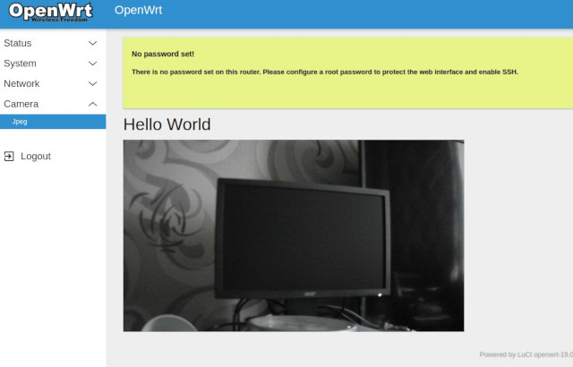

<p align="center">
 
</p>

<h3 align="center">WRT-HisiCam</h3>

---

<p align="center">OpenWrt based firmware for HiSilicon`s System-On-a-Chip ip cameras</p>
<p align="center"><em>Part of OpenHisiIpCam project</em></p>

## :pencil: Table of Contents
- [About](#about)
- [Hardware support](#hardware-support)
- [Usage](#usage)
- [Build from scratch](#build-from-scratch)
- [Roadmap](#roadmap)
- [Implementation details](#implementation-details)
- [Feature requests and contribution](#feature-requests-and-contribution)

## :eyeglasses: About
This is attempt to make full functional firmware for HiSilicon based ip cameras.
*Full functional* in our sense is firmware that has minimum general management functions (network control),
easy update/upgrade and some kind of web user interface. OpenWrt is only one known project, that targets embedded devices and has above features out of the box.

**At the moment project is targetted to homebrew usage or simple in house production.** 

### What WRT-HisiCam IS and what it IS NOT

WRT-HisiCam is firmware build based on [OpenWrt](https://openwrt.org/) with mostly same functionality across all supported platforms.
Project is not targetted to be pushed to OpenWrt upstream, it is also developed not as fork, but as source tree modification, to simplify subsequent updates.

It IS NOT OpenWrt port to HiSilicon platfroms. Changing configuration may cause build fails 
(especially packages that depends on some kernel modules, ordinary packages most probably should work, but have to be tested). 
This means that adding new and improving existing functionality requires some technical skills and expirience.

For feature requests and contribution read corresponding [section](#feature-requests-and-contribution). 

If your case is rather different than this project take a look on [BR-HisiCam](https://github.com/OpenHisiIpCam/br-hisicam)
this is our test linux environment for HiSilicon SoCs, suitible for developing any projects from scratch.

## :camera: Hardware support

**TODO**

### SoCs

| chips                                                 | family        | kernel |support|
|-------------------------------------------------------|---------------|--------|-------|
| hi3516av100, hi3516dv100                              | hi3516av100   |4.9.37  |Yes    |
| hi3519v101,  hi3516av200                              | hi3516av200   |3.18.20 |Yes    |
| hi3516cv100, hi3518cv100, hi3518ev100                 | hi3516cv100   |3.0.8   |No     |
| hi3516cv200, hi3518ev200, hi3518ev201                 | hi3516cv200   |4.9.37  |TODO   |
| hi3516cv300, hi3516ev100                              | hi3516cv300   |3.18.20 |Yes    |
| hi3516cv500, hi3516dv300, hi3516av300                 | hi3516cv500   |4.9.37  |Yes    |
| hi3516ev300, hi3516ev200, hi3516dv200, hi3518ev300    | hi3516ev200   |4.9.37  |Yes    |
| hi3519av100                                           | hi3519av100   |4.9.37  |TODO   |
| hi3559av100                                           | hi3559av100   |4.9.37  |TODO   |

### Camera modules

Most probably we will support only camera modules with RAM >= 128M.

**TODO**

For detailed modules description check [BR-HisiCam boards catalog](https://github.com/OpenHisiIpCam/br-hisicam/tree/master/br-ext-hisicam/board#boards-catalog).

## :rocket: Usage

**TODO**

## :hammer: Build from scratch

```console
foo@bar:~$ git clone --recursive https://github.com/OpenHisiIpCam/wrt-hisicam --depth 1
foo@bar:~$ cd wrt-hisicam
foo@bar:~$ make ubuntu-deps
foo@bar:~$ make prepare
foo@bar:~$ cd openwrt && make menuconfig
```

In top menu item select `Target System` and then your family platform. Then
select item `Subtarget` and your specific SoC type. Then select `Exit` and save
new configuration.

```console
foo@bar:~$ make defconfig
foo@bar:~$ make -j$(nproc)
```

**TODO**

## :clipboard: Roadmap

**TODO**

## :notebook: Implementation details

OpenWrt version 19.07.3.

**TODO**

## :open_hands: Feature requests and contribution

**TODO**
