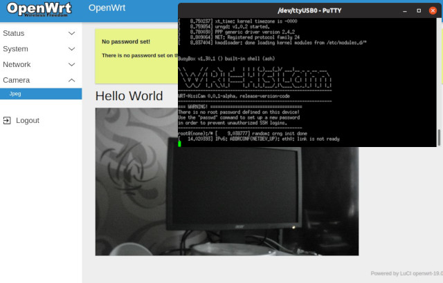

<p align="center">
 
</p>

<h3 align="center">WRT-HisiCam</h3>

---

<p align="center">OpenWRT based firmware for HiSilicon`s System-On-a-Chip ip cameras</p>
<p align="center"><em>Part of OpenHisiIpCam project</em></p>

## :pencil: Table of Contents
- [About](#about)

## :eyeglasses: About
This is attempt to make full functional firmware for HiSilicon based ip cameras.
*Full functional* in our sense is firmware that has minimum general management functions (network control),
easy update/upgrade and some kind of web user interface. OpenWrt is only one known project, that targets embedded devices and has above features out of the box.

If you are looking for development environment take a look on [BR-HisiCam](https://github.com/OpenHisiIpCam/br-hisicam).

## What WRT-HisiCam is and what it is not

WRT-HisiCam is firmware build based on [OpenWrt](https://openwrt.org/) 

## Chip support

| chips                                                 | family        | kernel |support|
|-------------------------------------------------------|---------------|--------|-------|
| hi3516av100, hi3516dv100                              | hi3516av100   |4.9.37  |Yes    |
| hi3519v101,  hi3516av200                              | hi3516av200   |3.18.20 |Yes    |
| hi3516cv100, hi3518cv100, hi3518ev100                 | hi3516cv100   |3.0.8   |NO     |
| hi3516cv200, hi3518ev200, hi3518ev201                 | hi3516cv200   |4.9.37  |Yes    |
| hi3516cv300, hi3516ev100                              | hi3516cv300   |3.18.20 |Yes    |
| hi3516cv500, hi3516dv300, hi3516av300                 | hi3516cv500   |4.9.37  |Yes    |
| hi3516ev300, hi3516ev200, hi3516dv200, hi3518ev300    | hi3516ev200   |4.9.37  |Yes    |
| hi3519av100                                           | hi3519av100   |4.9.37  |TODO   |
| hi3559av100                                           | hi3559av100   |4.9.37  |TODO   |

## Usage

## Build from scratch

## Roadmap


## Patching

target linux generic files -> _files

## Helpers

* `ifconfig eth0 192.168.10.X netmask 255.255.255.0 up`
* `route add default gw 192.168.10.1`

## Notes

`WARNING: .../openwrt-19.07.2/bin/targets/hi3516ev200/generic-glibc/packages/Packages to workaround usign SHA-512 bug!`

See:
* https://forum.openwrt.org/t/warning-message-usign-after-build-18-06-5/48419
* https://git.openwrt.org/?p=openwrt/openwrt.git;a=commitdiff;h=e1f588e446c7ceb696b644b37aeab9b3476e2a57
* https://forum.openwrt.org/t/signature-check-failed-after-clean-installation/41945

### Building all packages

```
./scripts/feeds uninstall -a
./scripts/feeds install -a -d m
```

* https://forum.archive.openwrt.org/viewtopic.php?id=29619
* https://openwrt.org/docs/guide-user/additional-software/imagebuilder
